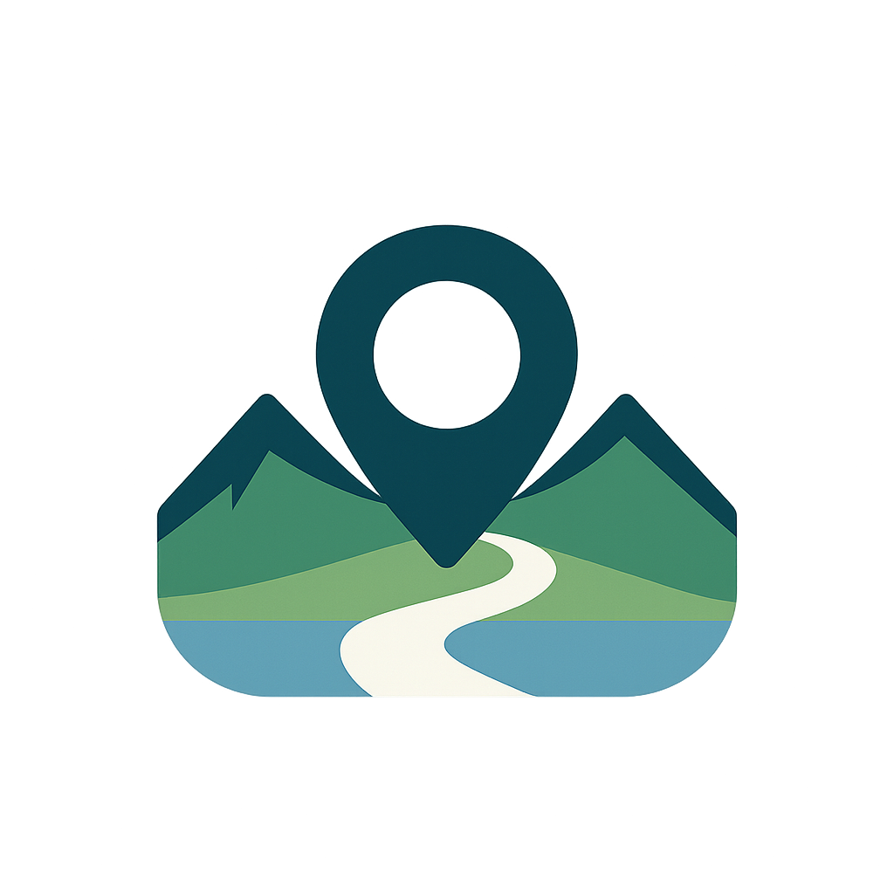

<div align="center">
  
  <h1>iNomad</h1>
  <p><i>A smart traveling app for fishing spots, trails and wild places.</i></p>
</div>

---

## 🌍 What is iNomad?

**iNomad** is a mobile application built for adventurers, nature lovers, and explorers.  
It helps users **discover, save, and share outdoor locations** like:

- Fishing spots 🎣  
- ATV and off-road trails 🛻  
- Remote campsites ⛺  
- Hidden gems and cool places 🧭  

---

## ✨ Key Features

- 📍 Add public or private "spots" with coordinates
- 👥 Community sharing for public locations
- 🗺️ Interactive map with GPS navigation
- 🔐 User accounts (email/password login)
- 📶 Works offline after saving locations

---

## 🚧 Project Status

This project is in active development.  
The current version is still in **pre-production** — not yet released on the Play Store.

---

## 📦 Tech Stack

- React Native (Expo)
- Supabase (auth + database)
- PostgreSQL
- JavaScript

---

## 🛠️ Running the App Locally

```bash
git clone https://github.com/your-username/iNomad.git
cd iNomad
npm install
npx expo start
```


📄 License
This project is licensed under the
Creative Commons Attribution-NonCommercial 4.0 International.

You are free to use, modify, and share this code for non-commercial purposes only.
For commercial use, please contact the author directly.


☕ Support
If you like this project or want to support development:
→ Follow the dev on GitHub: @Blast-Pop

<div align="center"> <sub>© 2025 Blast-Pop. All rights reserved.</sub> </div> 
