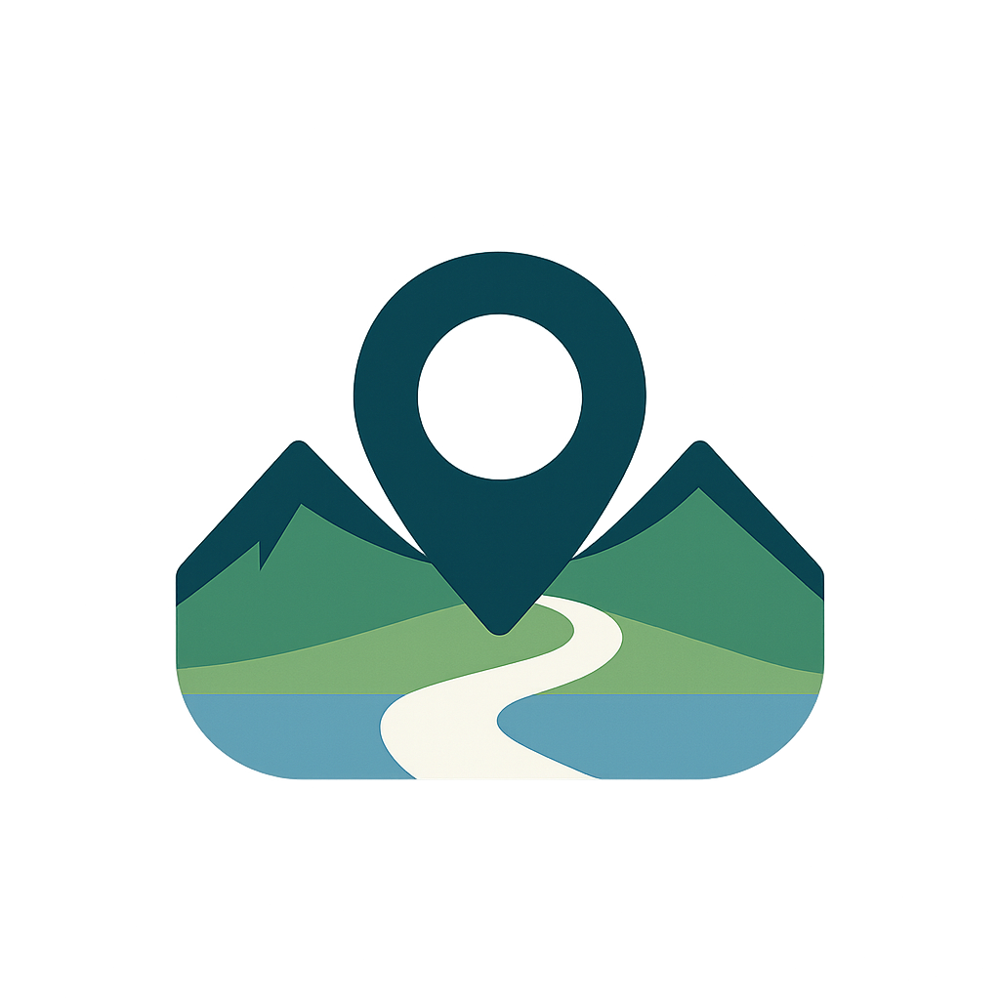

<div align="center">
  
  <h1>iNomad</h1>
  <p><i>A smart traveling app for fishing spots, trails and wild places.</i></p>

  [](https://opensource.org/licenses/MIT)
  [](https://expo.dev)
  [](#)
</div>

---

## 🌍 What is iNomad?

**iNomad** is a mobile application built for adventurers, nature lovers, and explorers.
It helps users **save and share outdoor locations** like:

- Fishing spots 🎣
- ATV and off-road trails 🛻
- Remote campsites ⛺
- Hidden gems and cool places 🧭

---

## ✨ Key Features

- 📍 Add spots with GPS coordinates and activity tags
- 🗺️ Interactive map with navigation hand-off to Google Maps
- 📶 100% offline-first — your spots live on your phone
- 🔒 No accounts, no servers — local-only identity (ed25519 keypair)
- 📡 **(coming v0.2)** Peer-to-peer sharing over Bluetooth — AirDrop-style for outdoor spots

---

## 🚧 Project Status

**v0.2 in active development** — pivoting away from cloud (Supabase) toward a fully standalone,
offline-first, peer-to-peer architecture. Not yet on the Play Store; sideload APK from the
[Releases](https://github.com/Blast-Pop/iNomad/releases) page when available.

---

## 📦 Tech Stack

- React Native + Expo (SDK 53)
- AsyncStorage for local persistence
- expo-secure-store + ed25519 (planned) for local identity
- react-native-ble-plx (planned) for proximity P2P
- React Navigation (drawer)

---

## 🛠️ Running the App Locally

```bash
git clone https://github.com/Blast-Pop/iNomad.git
cd iNomad
cp .env.example .env       # then fill in GOOGLE_MAPS_API_KEY
npm install
npx expo start
```

You'll need a Google Maps API key (free tier is fine for development). Get one at
[Google Cloud Console → APIs & Services → Credentials](https://console.cloud.google.com/apis/credentials).
Restrict it to package `com.blastpop.iNomad` + your SHA-1 keystore fingerprint.

---

## 📄 License

[MIT](LICENSE) — free to use, modify, distribute, including commercially.

---

## 🙌 Contributing

Issues and PRs welcome. This is a solo-dev project for now, but the codebase is small and
hackable. See [the plan](https://github.com/Blast-Pop/iNomad/blob/main/README.md) for what's
coming next.
